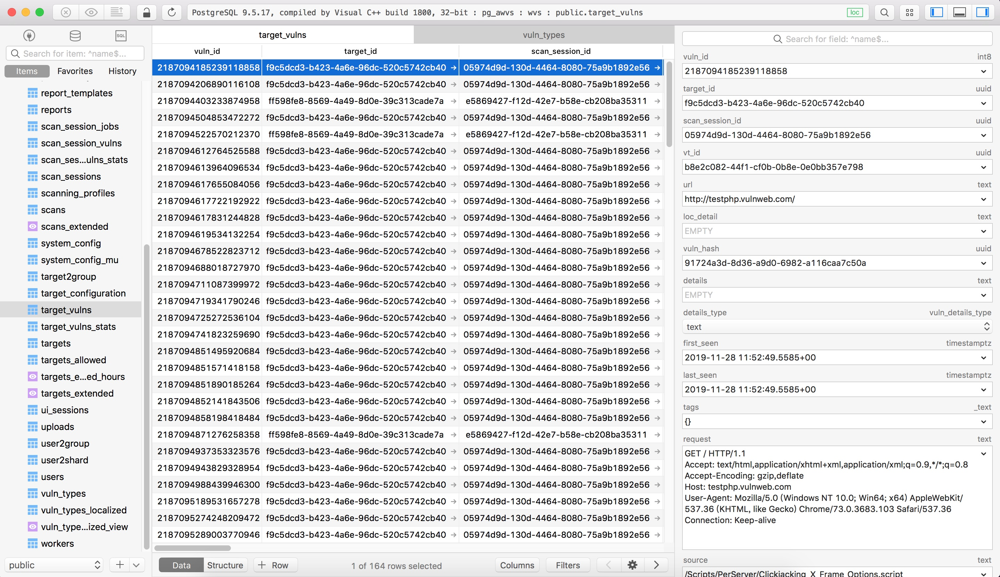

# 关于该 API

看了 https://github.com/h4rdy/Acunetix11-API-Documentation 封装的 12 的 api，凑活能用。。。

感谢 [@h4rdy](https://github.com/h4rdy)

# awvs 允许 pgsql 远程链接

1. 关闭服务，服务名称是 Acunetix Database

2. 修改文件 C:\ProgramData\Acunetix\db\pg_hba.conf

   ```
   IPv4 local connections:
   host    all             all             127.0.0.1/32             md5
   host    all             all             10.11.11.0/24            md5
   ```


3. 修改文件 C:\ProgramData\Acunetix\db\postgresql.conf

   ```
   listen_addresses = '0.0.0.0'
   ```

4. 重新启动服务(还是连不上的话注意防火墙)


数据库的连接信息在 C:\ProgramData\Acunetix\settings.ini 中

这里连上看下表 target_vulns 中的漏洞信息



